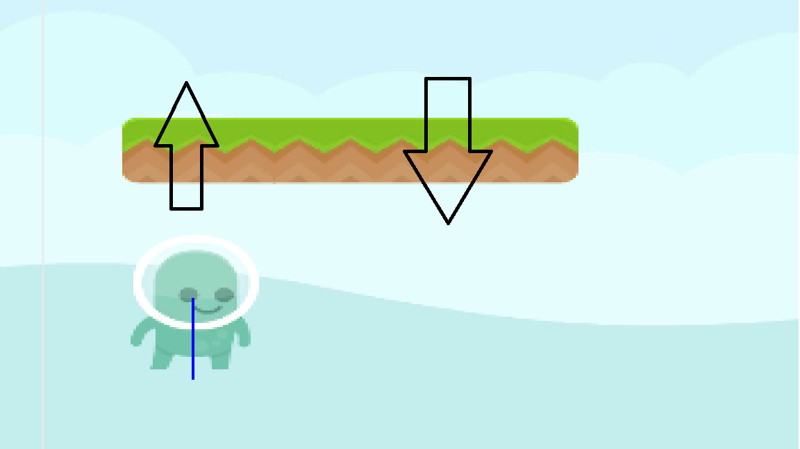
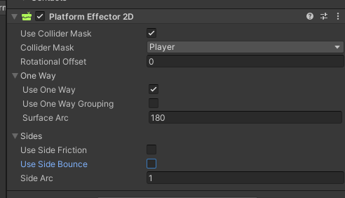
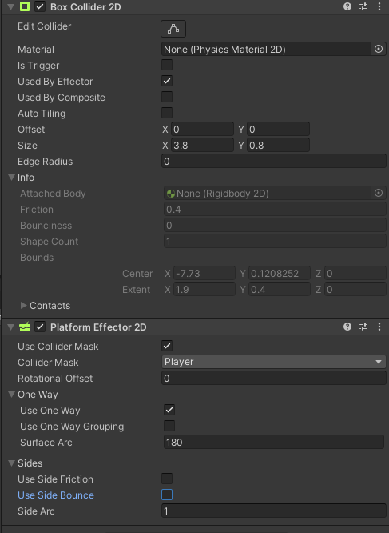

## 개요

---

정말 오랜만에 2D프로젝트를 만들고있다.
무한 런게임을 제작중인데,

공중 발판을 제작하던 중
생각해보니

> '캐릭터가 발판 아래에서 점프를하면 발판에 충돌하지 않고 위로 올라가야할텐데...'

라는 생각이 들어 찾아보게 되었고
해법을 정리한다.

## 본문

---

처음에는 이렇게 생각했다.

1\. 플레이어가 발 아래로 캐스팅을 쏴서 발판의 콜라이더를 온오프?

2\. 반대로 발판이 오버랩 검사를 해서 플레이어가 위에있을때만 콜라이더를 온?

하지만 연산이 걱정되기도하고 워난 플랫폼 게임이라면 항상있는 소위말하는 국룰이니까 찾아보면 있을것같아서

찾아봤다.

검색어를 어떻게 해야할지 난감해서

'unity 2d air platform'

'unity 2d up platform'

이런식으로 검색해봤는데 정답은

**"One-Way Platforms"** 였다.

더군다나 이 기능은 Unity에서 컴포넌트로 제공하고있다.

[플랫폼 이펙터 2D 공식 매뉴얼](https://docs.unity3d.com/kr/530/Manual/class-PlatformEffector2D.html)

이 컴포넌트인데

플랫폼에 콜라이더를 먼저 붙이고

콜라이더에 **Used By Effector** 를 체크해준 후 이 컴포넌트를 붙이면 된다.

물론 **Use One Way** 는 체크돼있어야 하지만 디폴트로 체크돼있다.

이렇게만 하면 아래에서 위로갈때는 충돌이 일어나지않고

위에서 아래로는 충돌이 일어나서 플랫폼위에 서있게된다!

이렇게 쉽다니...

만약 플랫폼게임에서 흔한패턴인

**"아래방향키를 누르면 내려오기"**를 구현할려면

<iframe src="https://www.youtube.com/embed/7rCUt6mqqE8" width="860" height="484" frameborder="0" allowfullscreen="true"></iframe>

위 영상을 참고하면 될것같다.

## 결론

---

Unity에서 2D와 3D의 제일 큰 차이점은 개인적인 생각으론

물리 시뮬레이션 쪽이다.

왜냐하면 콜라이더 컴포넌트도 2D전용 따로,

리지드바디도 따로,

레이를 쏘려해도 Physics2D클래스로 따로 접근해야한다.

그래서 3D를 주로한 나로서는 아직 잘 모르는 부분이 많은것같다.

특히 Effector2D컴포넌트 시리즈는 찾아보니까

종류도 굉장히 많고 기능도 훌륭하다.

이 계기로 알게됐으니 나중에 Effector2D컴포넌트를 먼저 떠올릴 수 있을것 같다.
